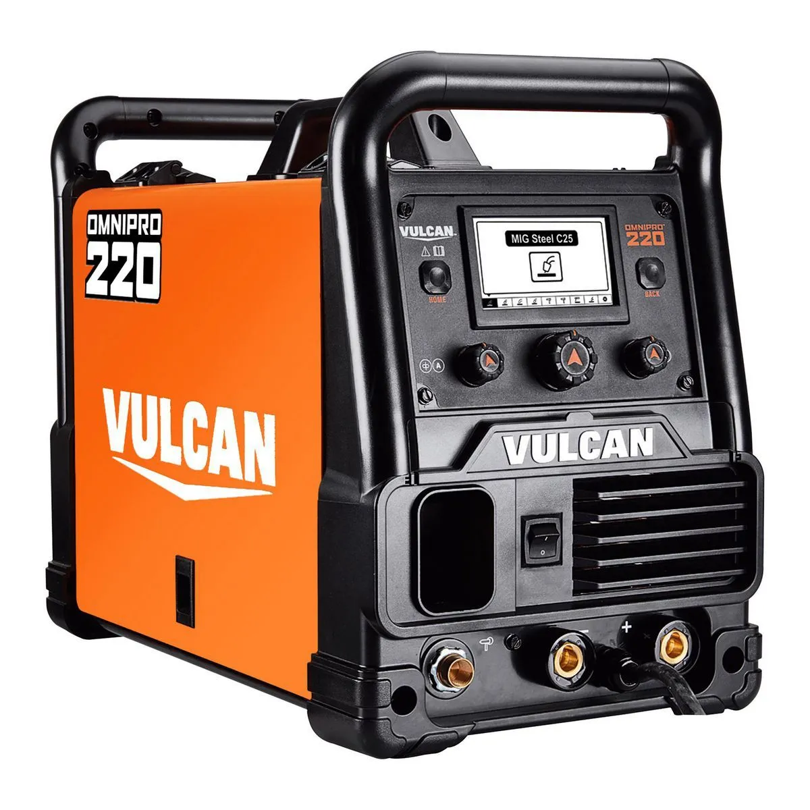
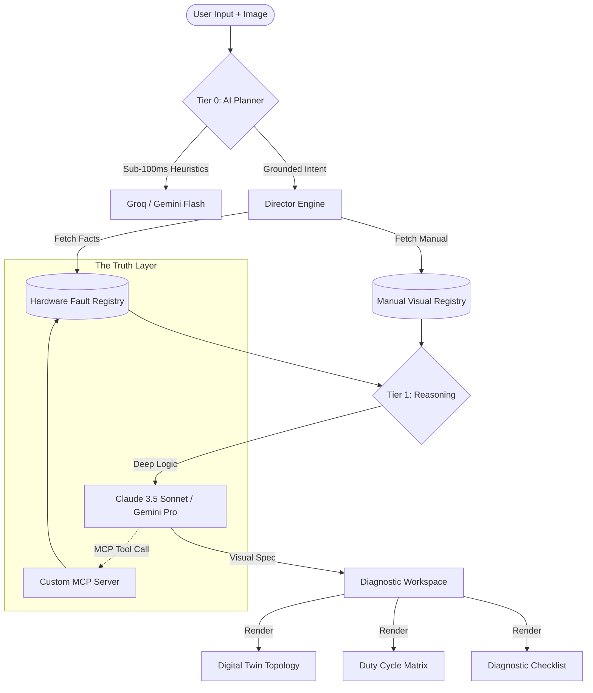
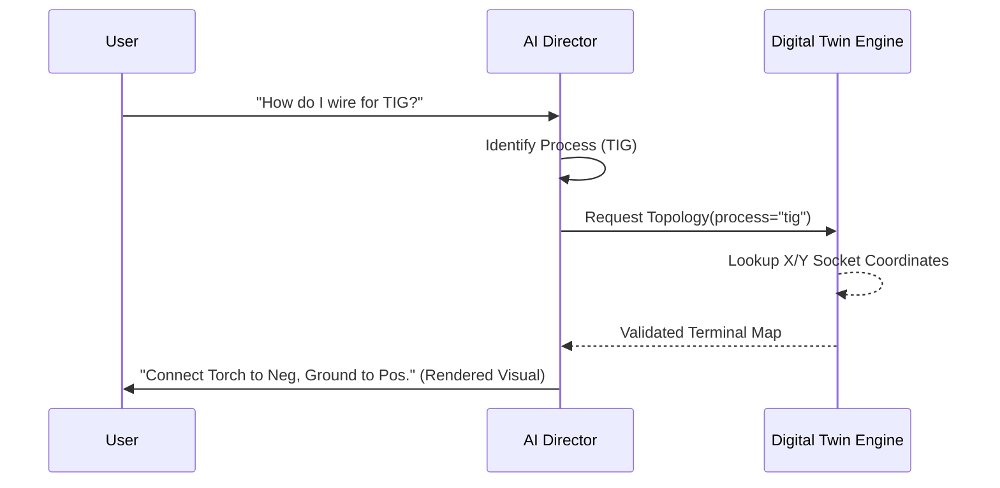
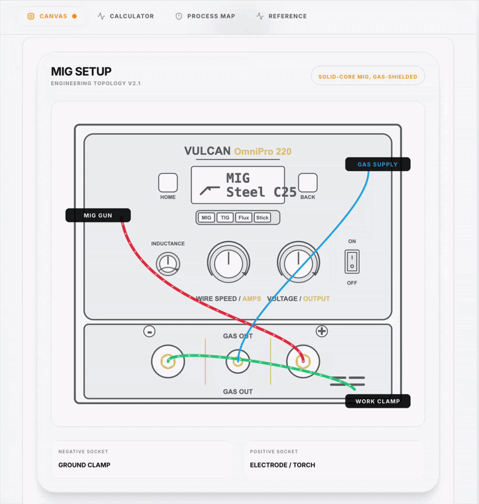
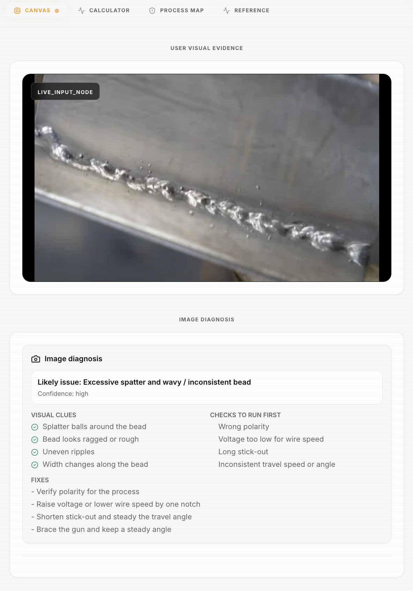
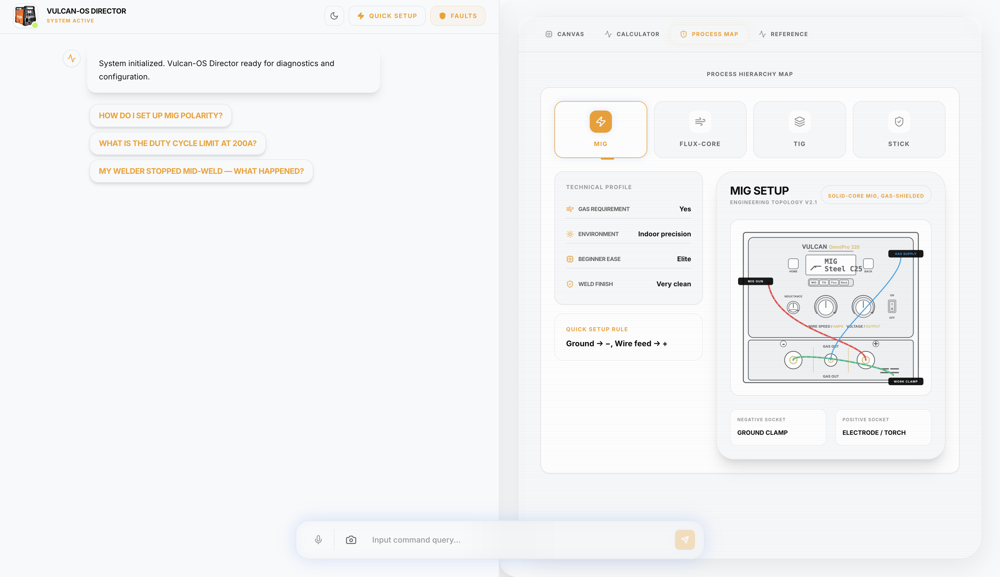

<div align="center">
  

  <h1>Vulcan-OS (VO): The Ultimate Engineering Artifact</h1>
  <h3>The Autonomous, Grounded Hardware Diagnostic Engine.<br>A multi-modal infrastructure that teaches you to build for the physical world.</h3>

  <p>
    <a href="https://prox.ashishsandhu.com/"><strong>🌐 Live Demo: prox.ashishsandhu.com</strong></a>
  </p>

  <p>
    
    
    
    
    
    
    
  </p>

  <br>

  <!-- HERO MEDIA -->
  <div align="center">
    <video src="public/images/hero-demo.mp4" width="100%" style="border-radius: 16px;" autoplay loop muted playsinline></video>
    <p><em>[High-fidelity hands-free diagnostic flow]</em></p>
  </div>

  <br>

</div>

---

## 📖 The Foundation: What this is

The Vulcan OmniPro 220 is not a simple tool. It supports MIG, flux-core, TIG, and stick. It runs on 120V and 240V. Each process has different polarity, gas, wire-feed, and duty-cycle rules.

The manual has the answers, but the answers are spread across tables, setup diagrams, troubleshooting charts, process-selection pages, and weld defect images.

**Vulcan-OS (VO)** turns that manual into a garage-side support experience. It doesn't just answer questions; it **directs** the user through high-risk hardware configurations with the precision of a senior welding engineer.

---

## 🧠 The Agentic Architecture: Multi-Tier Reasoning

VO uses a **Modular Multi-Agent Ecosystem**. We separate **Direction** (AI Reasoning) from **Execution** (Deterministic Rendering).

### System Data Flow


### 🛠️ Elite Feature: The Deterministic Safety Arbiter
Every AI model hallucinations. In a welding garage, a hallucinated polarity setup can destroy a machine or ruin a workpiece. **Vulcan-OS solves this with a Safety Arbiter:**
- **Truth Over Prose**: If the LLM generates a response that contradicts the hardcoded safety facts in `ProductGrounding.ts`, the system **clobbers the AI response** and replaces it with the canonical, verified setup recipe.
- **Pre-emptive Grounding**: Critical facts (like duty-cycle limits) are auto-prepended to answers by the application layer, ensuring the user sees the "Truth" before the "Narrative."

---

## 🔄 Architectural Flexibility: The "Driver" Model

Vulcan-OS is a product-agnostic **orchestration layer**. While currently grounded in the Vulcan OmniPro 220, the system is designed as a "compiler" for any technical hardware product. 

### The "Data-Swap" Pivot
Transitioning VO to a new domain (e.g., a 3D printer, CNC mill, or medical device) requires zero architectural changes—only a data injection:

1.  **Hardware Fault Registry**: Swap the 15+ welding fault nodes in `src/data/` for the new product's error codes (e.g., "Extruder Clog", "Z-Axis Limit").
2.  **Product Grounding**: Update the technical constraints (thermal limits, power specs, material matrices) in `src/data/ProductGrounding.ts`.
3.  **Visual Registry**: Map new manual diagrams and component photos in `src/data/VisualRegistry.ts`.
4.  **Deterministic Engines**: Update the "Quick Setup" decision tree in `src/engines/quickSetup.ts` to reflect the new product's initialization sequence.

**Infrastructure-First Outcome**: The "Director" logic (streaming, voice, multimodal intent routing) remains untouched. You aren't building a single-use app; you're deploying a **Universal Technical Support OS**.

---

## 🏛️ Lesson 1: The Philosophy of AI as Infrastructure

Every hardware assistant on the market makes a fundamental error: **They treat documentation as a text-retrieval task.** 

### Why This Matters (The Student's Guide)
1.  **Red-Teaming Constraints**: We treat hardware specs (Polarity, Duty Cycle, Gas Flow) as **Hard Constraints**. The AI is not allowed to "suggest" these; it must **enforce** them.
2.  **Deterministic Grounding**: By separating the "Brain" (LLM) from the "Truth" (Manual Registry), we ensure that the system is 100% accurate on safety-critical data.
3.  **No Hallucinations**: We use a **Digital Twin Topology Engine**. The AI explains the logic, but the **Application Layer** controls the physical coordinates of the wiring diagram.

---

## 📐 Lesson 2: Digital Twin Topology (The "Digital Twin")

**The Problem**: AI models are notoriously bad at spatial reasoning. If you ask an LLM to "draw a wiring diagram," it will likely hallucinate cable paths.
**The Solution**: VO uses a Digital Twin. We have mapped every physical port of the Vulcan OmniPro 220 to a pixel-perfect React coordinate system. 



---

## 🏗️ Technical Implementation: Defense in Depth

Vulcan-OS uses a layered reliability model to ensure garage-side stability:

1. **Custom MCP Server**: Built on the **Claude Agent SDK**, our `vulcan` MCP server exposes programmatic tools (`lookup_vulcan_manual_context`) that allow Claude to dynamically fetch manual evidence with sub-page precision.
2. **Hybrid Voice Pipeline**: Optimized for "Gloves-On" utility.
    - **Immersive Mode**: A continuous Whisper-based capture loop for power users.
    - **Wake-Word Mode**: Browser-native listener for "Hey Vulcan" that triggers high-fidelity transcription.
3. **Topology Coordinate Mapping**: The Digital Twin is not a generated SVG; it is a React engine where every physical port is mapped to pixel-perfect X/Y coordinates on the product image.

---

## 🛠️ Key Capabilities: What it can do

<!-- CAPABILITY GALLERY PLACEHOLDER -->
<div align="center">
  <table>
    <tr>
      <td width="50%"><br><em>[Digital Twin Topology Engine]</em></td>
      <td width="50%"><br><em>[Multi-Modal Vision Audit]</em></td>
    </tr>
  </table>
</div>

- **Answer polarity questions** and draw the cable setup deterministically.
- **Show the real manual image** when the answer depends on a specific diagram.
- **Calculate duty cycle** and convert it into weld/rest time.
- **Compare MIG, flux-core, TIG, and stick** setups in a high-fidelity table.
- **Render pre-weld checklists** for one process or all four processes.
- **Walk through porosity, spatter, wire-feed, and bad-weld troubleshooting.**
- **Diagnose uploaded weld photos** with Claude vision.
- **Recommend a process** from location, gas, material, and thickness.
- **Surface fault states** like HOT, low voltage, over voltage, no power, no arc.
- **Deterministic Response Normalization**: Automatic clobbering of LLM hallucinations if they contradict safety registries.

---

## 📚 Knowledge Model: The "Truth Layer"

The manual is represented as structured product knowledge instead of raw PDF chunks.

- `src/data/HardwareFaultRegistry.ts` - 15+ Proprietary failure nodes.
- `src/data/ProductGrounding.ts` - Polarity, duty cycle, and setup facts.
- `src/data/VisualRegistry.ts` - Manual images, page numbers, and display rules.
- `src/engines/AIPlanner.ts` - High-speed AI intent classification.
- `src/engines/RiskAssessmentEngine.ts` - Smart warnings for common high-risk mistakes.

### Grounded Facts (Examples):
- **MIG**: Ground clamp -> negative (-), MIG Gun -> positive (+), Gas required.
- **Flux-core**: Ground clamp -> positive (+), Wire feed -> negative (-), No gas.
- **240V at 200A**: 25% duty cycle (2.5m weld / 7.5m rest).

---

## 🏁 Lesson 3: Product Decisions & Engineering Rationale

**1. Diagrams for wiring.**  
Polarity is spatial. Users should see which lead goes into which socket. We use React components, not generated SVGs.

**2. Short answer first.**  
The user is in a garage. The first sentence should answer the question. The extra UI carries the detail.

**3. No fake precision.**
When exact wire speed is not grounded in the manual, VO guides the user to the machine's synergic settings instead of hallucinating numbers.

---

## 🚀 Infrastructure & Performance

Built for "Gloves-On" utility, VO optimizes for **Latency-to-Action**.

| Layer | Model Option | Latency | Role |
| :--- | :--- | :--- | :--- |
| **Intent Planning** | Gemini Flash-Lite / Groq (Llama) | **< 150ms** | Sub-100ms command routing & slot extraction. |
| **Vision Analysis** | Claude Sonnet / Gemini Pro | **< 2s** | High-fidelity weld bead & hardware audit. |
| **Audio Gen** | ElevenLabs / Fish Audio | **< 3s** | Ultra-realistic technical speech synthesis. |
| **Topology Rendering** | React / Framer | **Instant** | Deterministic Digital Twin visualization. |
| **Voice Buffer** | Web Audio API | **Parallel** | Hands-free shop floor orchestration. |

---

## 🛠️ Deployment & Local Setup (The Student's Lab)

### 1. Installation
```bash
git clone https://github.com/ashishsandhu/vulcan-os.git
cd vulcan-os
npm install
cp .env.example .env
```

### 2. Verification Lab
Run these test queries to confirm calibration:
- **Duty Cycle**: `What's the duty cycle for 200A on 240V?`
- **Polarity**: `How do I wire for TIG?`
- **Troubleshooting**: `I'm seeing pinholes in my weld.`

---

## 🏛️ UI/UX: The Support Cockpit

<!-- UI GALLERY PLACEHOLDER -->
<div align="center">
  
  <p><em>[Screenshot showing the split-pane Chat and Canvas interface]</em></p>
</div>

The app is built as a support cockpit:

- **Chat on the left**: High-context engineering dialogue.
- **Visual workspace on the right**: Real-time Digital Twin diagrams and diagnostic cards.
- **Inline tables and checklists**: Actionable steps inside the conversation.
- **Diagnostic Canvas**: Persistent view for duty-cycle, polarity, and vision results.
- **Image upload**: Multimodal entry for live weld diagnosis.
- **Voice dictation**: Hands-free shop floor utility with sentence buffering.

This is meant to feel like a technical support expert standing next to the welder, not a document search page.

---

## 🏛️ About the Architect: Ashish Sandhu

I am an **AI Infrastructure Engineer** and 2x founder. I treat LLMs as **Recursive Thinking Partners** to "red-team" constraints and failure states. I don't build wrappers; I build systems that compound in value over time.

- **Seniority**: Building with generative models since the GPT-2/BART era (2017).
- **Scale**: Architected systems supporting **10M+ MAU** and **25k+ concurrent users**.
- **Recognition**: UK National Digital Startup of the Year Winner & AI Entrepreneur of the Year Finalist.
- **Talent Status**: O-1A Visa eligible (ensuring frictionless sponsorship for elite talent).

<p>
  <a href="https://linkedin.com/in/ashishsandhu"></a>
  <a href="https://x.com/ashishsandhu"></a>
  <a href="mailto:ashishkumarsandhu@gmail.com"></a>
</p>

---

<div align="center">
  <sub>If this project moves the needle for your engineering journey, please ⭐ the repo. It genuinely matters.</sub>
</div>
